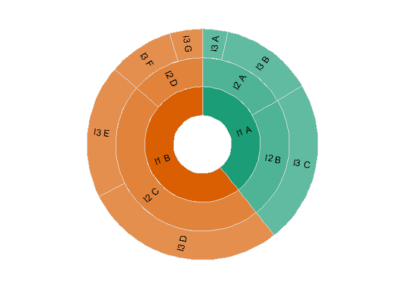

<!-- README.md is generated from README.Rmd. Please edit that file -->

# ggsunburst

<!-- badges: start -->

[](https://lifecycle.r-lib.org/articles/stages.html#experimental)
<!-- badges: end -->

The goal of ggsunburst is to create a sunburst plot without much effort
while allowing to create more complex plots with a bit of work.

## Installation

You can install the development version of ggsunburst from
[GitHub](https://github.com/) with:

``` r
# install.packages("devtools")
devtools::install_github("sachijay/ggsunburst")
```

## Example

This is a basic example which shows you how to solve a common problem:

``` r
library(ggsunburst)

in_dat <- tibble::tibble(
  level1_var = c(
    rep("l1 A", times = 3),
    rep("l1 B", times = 4)
  ),
  level2_var = c(
    "l2 A", "l2 A", "l2 B",
    "l2 C", "l2 C", "l2 D", "l2 D"
  ),
  level3_var = c(
    "l3 A", "l3 B", "l3 C",
    "l3 D", "l3 E", "l3 F", "l3 G"
  ),
  values_var = c(
    123, 456, 798,
    987, 654, 321, 159
  )
)

in_dat
#> # A tibble: 7 × 4
#>   level1_var level2_var level3_var values_var
#>   <chr>      <chr>      <chr>           <dbl>
#> 1 l1 A       l2 A       l3 A              123
#> 2 l1 A       l2 A       l3 B              456
#> 3 l1 A       l2 B       l3 C              798
#> 4 l1 B       l2 C       l3 D              987
#> 5 l1 B       l2 C       l3 E              654
#> 6 l1 B       l2 D       l3 F              321
#> 7 l1 B       l2 D       l3 G              159

plot_dat <- get_sunplot_dataset(
  .dat = in_dat,
  level1_var, level2_var, level3_var,
  .count_var = values_var
)

plot_dat
#> # A tibble: 14 × 7
#>    .name .level .fill .box_min .box_max .alpha .angle
#>    <chr>  <int> <chr>    <dbl>    <dbl>  <dbl>  <dbl>
#>  1 <NA>       0 <NA>    0        1       0     -90   
#>  2 l1 A       1 l1 A    0        0.394   1      19.1 
#>  3 l1 B       1 l1 B    0.394    1       1      19.1 
#>  4 l2 A       2 l1 A    0        0.166   0.75   60.2 
#>  5 l2 B       2 l1 A    0.166    0.394   0.75  -10.7 
#>  6 l2 C       2 l1 B    0.394    0.863   0.75   43.8 
#>  7 l2 D       2 l1 B    0.863    1       0.75  -65.3 
#>  8 l3 A       3 l1 A    0        0.0352  0.667  83.7 
#>  9 l3 B       3 l1 A    0.0352   0.166   0.667  53.9 
#> 10 l3 C       3 l1 A    0.166    0.394   0.667 -10.7 
#> 11 l3 D       3 l1 B    0.394    0.676   0.667  77.5 
#> 12 l3 E       3 l1 B    0.676    0.863   0.667  -6.95
#> 13 l3 F       3 l1 B    0.863    0.955   0.667 -57.1 
#> 14 l3 G       3 l1 B    0.955    1       0.667 -81.8

draw_sunburst_plot(
  .dat = plot_dat,
  .label_txt_size = 4,
  .linewidth = 0.5,
  palette = "Dark2"
)
#> Warning: Removed 1 rows containing missing values (`geom_text()`).
```


